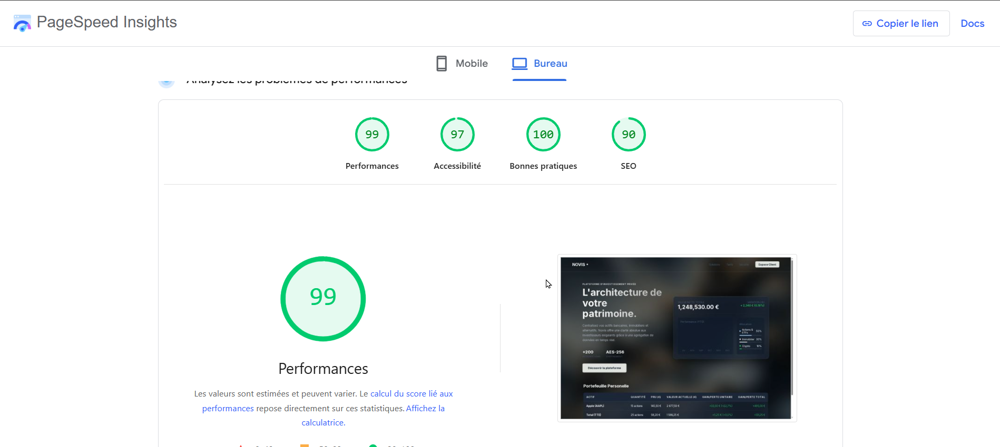

# NOVIS

Landing page - Plateforme d'investissement privée.

## 📸 Aperçu

### Desktop

### Mobile

---

## ❓ Questions

**Qu'est-ce que le Layout Shift ?**  
Le layout shift, c'est quand des éléments se déplacent soudainement après le chargement (ex: une image qui arrive tard).

**À quoi sert aria-label ?**  
C'est un label invisible pour les lecteurs d'écran. Permet aux personnes malvoyantes de comprendre les boutons sans texte visible.

**À quoi sert loading="lazy" ?**  
Charge les images seulement quand l'utilisateur s'en rapproche. Moins de données à télécharger = site plus rapide.

---

## 📊 Performance

