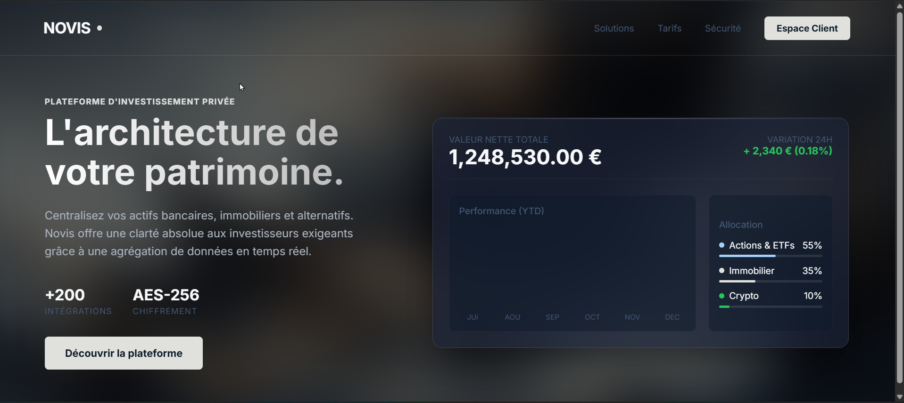

NOVIS :  

❓Expliquez ce qu’est le Layout Shift.
--> Le layout shift, c'est quand des éléments se déplacent soudainement après le chargement (ex: une image qui arrive tard).

❓Expliquez à quoi sert aria-label.
--> C'est un label invisible pour les lecteurs d'écran. Permet aux personnes malvoyantes de comprendre les boutons sans texte visible.

❓On utilise souvent loading="lazy” expliquez son utilité.
--> Charge les images seulement quand l'utilisateur s'en rapproche. Moins de données à télécharger = site plus rapide.